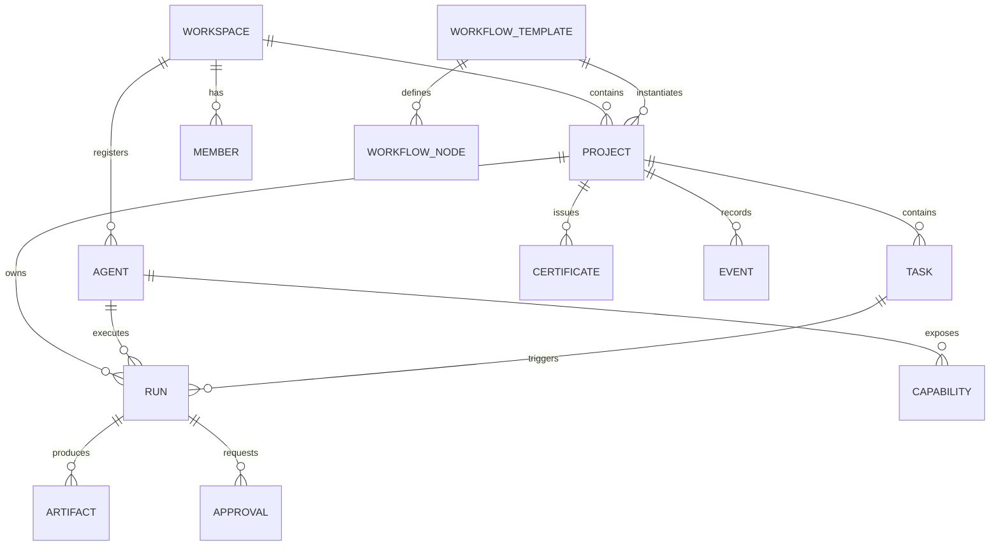

# 核心数据模型设计

## 1. 设计目标

用统一领域对象串起 `项目管理 -> 工作流执行 -> 产物沉淀 -> 审批留痕 -> 证明生成` 全链路，确保产品界面、接口设计和数据库建模使用同一套语义。

## 2. 核心实体关系

## 3. 核心实体定义

## 3.1 Workspace

用途：工作区边界、权限和资源隔离。

关键字段：

- `id`
- `name`
- `slug`
- `owner_member_id`
- `plan_type`
- `status`
- `created_at`

## 3.2 Member

用途：真人成员和审批人主体。

关键字段：

- `id`
- `workspace_id`
- `name`
- `email`
- `phone`
- `role`
- `status`

## 3.3 Project

用途：系统中的一级交付单元。

关键字段：

- `id`
- `workspace_id`
- `name`
- `project_code`
- `customer_name`
- `owner_member_id`
- `status`
- `target_delivery_at`
- `current_certificate_id`

建议状态：

- `draft`
- `active`
- `paused`
- `delivered`
- `archived`

## 3.4 Agent

用途：被管理的数字成员。

关键字段：

- `id`
- `workspace_id`
- `name`
- `avatar_url`
- `role_name`
- `tags`
- `adapter_type`
- `status`
- `description`
- `health_status`
- `last_seen_at`

建议状态：

- `active`
- `inactive`
- `maintenance`
- `error`

## 3.5 Capability

用途：描述 Agent 可执行的能力集合。

关键字段：

- `id`
- `agent_id`
- `name`
- `capability_code`
- `input_schema`
- `output_schema`
- `cost_model`
- `status`

## 3.6 WorkflowTemplate

用途：可复用的交付流程模板。

关键字段：

- `id`
- `workspace_id`
- `name`
- `scenario_type`
- `version`
- `trigger_type`
- `status`

## 3.7 WorkflowNode

用途：工作流节点定义。

关键字段：

- `id`
- `template_id`
- `node_type`
- `node_key`
- `name`
- `bound_agent_id`
- `retry_policy`
- `condition_expression`
- `next_node_keys`

节点类型建议：

- `task`
- `approval`
- `condition`
- `notification`
- `end`

## 3.8 Task

用途：项目中的工作项和管理对象。

关键字段：

- `id`
- `project_id`
- `source_template_id`
- `title`
- `description`
- `status`
- `priority`
- `owner_type`
- `owner_member_id`
- `owner_agent_id`
- `due_at`
- `blocked_reason`

建议状态：

- `backlog`
- `planned`
- `in_progress`
- `waiting_approval`
- `blocked`
- `completed`
- `delivered`

## 3.9 Run

用途：所有执行行为的统一实例对象，是全链路追踪的核心。

关键字段：

- `id`
- `project_id`
- `task_id`
- `workflow_instance_id`
- `node_key`
- `agent_id`
- `status`
- `trigger_type`
- `input_payload`
- `output_summary`
- `error_message`
- `retry_count`
- `trace_id`
- `started_at`
- `finished_at`

建议状态：

- `queued`
- `running`
- `waiting_approval`
- `succeeded`
- `failed`
- `cancelled`
- `timed_out`

## 3.10 Artifact

用途：Run 产生的结构化或非结构化产物。

关键字段：

- `id`
- `project_id`
- `run_id`
- `artifact_type`
- `title`
- `storage_uri`
- `mime_type`
- `sha256_digest`
- `metadata_json`

## 3.11 Approval

用途：审批、驳回、确认等人工控制动作。

关键字段：

- `id`
- `project_id`
- `run_id`
- `task_id`
- `approver_member_id`
- `decision`
- `comment`
- `decided_at`

建议决策值：

- `approved`
- `rejected`
- `cancelled`

## 3.12 Event

用途：系统行为事件和审计留痕。

关键字段：

- `id`
- `workspace_id`
- `project_id`
- `entity_type`
- `entity_id`
- `event_type`
- `actor_type`
- `actor_id`
- `trace_id`
- `payload_json`
- `occurred_at`

## 3.13 Certificate

用途：项目过程证明书及其验证材料。

关键字段：

- `id`
- `project_id`
- `certificate_no`
- `version`
- `status`
- `summary_json`
- `pdf_uri`
- `json_uri`
- `signature`
- `verification_code`
- `issued_at`

建议状态：

- `draft`
- `issued`
- `revoked`

## 4. 推荐数据库建模原则

- 业务主表统一使用 `UUID`
- 时间字段统一使用 `timestamp with time zone`
- 关键状态流转必须记录到 `event` 表
- JSON 字段只承载非核心结构，核心查询字段必须显式列出
- 所有跨实体链路保留 `trace_id`

## 5. 必要索引建议

- `project(workspace_id, status, updated_at desc)`
- `task(project_id, status, priority, due_at)`
- `run(project_id, status, started_at desc)`
- `run(trace_id)`
- `artifact(run_id)`
- `approval(run_id, decided_at desc)`
- `event(project_id, occurred_at desc)`
- `certificate(project_id, issued_at desc)`

## 6. 生命周期说明

## 6.1 Task 生命周期

`backlog -> planned -> in_progress -> waiting_approval -> completed -> delivered`

异常支路：

- 任意阶段可进入 `blocked`
- 审批驳回后回退到 `in_progress`

## 6.2 Run 生命周期

`queued -> running -> waiting_approval -> succeeded`

异常支路：

- `running -> failed`
- `running -> timed_out`
- `failed -> queued`（重试）
- 任意阶段可 `cancelled`

## 6.3 Certificate 生命周期

`draft -> issued -> revoked`

## 7. 审计与事件模型

以下动作必须落事件：

- 项目创建、归档、交付
- Agent 注册、禁用、恢复
- 模板创建、发布、变更
- Run 创建、开始、失败、完成、重试
- 审批通过、驳回、撤销
- 证明书生成、重新生成、撤销

## 8. 数据保留建议

- 任务、Run、Approval、Certificate 为长期保留数据
- 调试级原始日志可按 30-90 天策略归档
- 产物按项目策略保留，默认不少于 180 天
- 撤销的证明书不可物理删除，只允许标记失效
