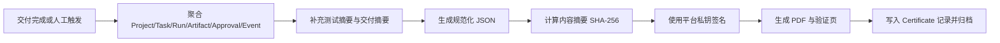

# 项目过程证明规范

## 1. 目标

将“项目过程证明书”定义为平台核心交付能力，而非单纯导出文档。证明书需要帮助客户理解项目如何被完成、由谁完成、完成到了什么程度，并且具备基本可验证性。

## 2. 命名约定

- 客户侧名称：`项目过程证明书`
- 平台内部能力名称：`Agent Delivery Provenance`

## 3. 信任模型

证明书不承诺法律层面的产权裁定，而承诺以下三点：

1. 平台可证明某一项目在某一时间窗口内存在一组真实记录的执行行为。
2. 平台可证明关键产物、审批和交付摘要与系统内留痕一致。
3. 平台可对证明书内容进行摘要校验，识别是否被篡改。

## 4. 证据来源

证明书的核心证据必须来自以下结构化对象：

- Project 基础信息
- Task 时间线
- Run 执行记录
- Artifact 产物元数据与摘要
- Approval 审批记录
- Event 审计事件
- 测试结果摘要

## 5. 证明书组成

## 5.1 封面信息

- 项目名称
- 项目编号
- 工作区名称
- 负责人
- 客户名称
- 交付日期
- 证明书编号

## 5.2 Agent 贡献概览

- 参与 Agent 清单
- 每个 Agent 的角色与职责
- 每个 Agent 的关键 Run 数量
- 主要产物和贡献摘要

## 5.3 关键时间线

- 项目启动时间
- 关键任务完成时间
- 审批节点时间
- 交付确认时间

## 5.4 关键产物清单

- 产物标题
- 类型
- 所属 Run
- SHA-256 摘要
- 存储引用

## 5.5 审批与测试摘要

- 审批人
- 审批结论
- 审批时间
- 关键测试结果
- 已知例外说明

## 5.6 交付摘要

- 交付范围
- 未纳入交付范围的事项
- 最终状态说明

## 5.7 校验信息

- 证明书版本
- 验证码
- 签名值
- 验证链接
- 生成时间

## 6. 生成时机

证明书可在以下场景触发生成：

- 项目阶段交付
- 项目最终交付
- 人工手动生成
- 模板流程在“交付完成”节点自动触发

## 7. 生成流程



## 8. 结构化 JSON 建议

```json
{
  "certificateNo": "CERT-2026-0001",
  "project": {
    "id": "prj_01J...",
    "name": "客户官网改版"
  },
  "agents": [],
  "timeline": [],
  "artifacts": [],
  "approvals": [],
  "deliverySummary": {},
  "digest": "sha256:...",
  "signature": "ed25519:..."
}
```

## 9. 摘要与签名规则

- 对规范化 JSON 文本计算 SHA-256 摘要
- 使用平台私钥进行 Ed25519 签名
- PDF 仅为展示载体，最终校验基于结构化 JSON 与签名
- 任何内容更新都必须生成新版本证明书，不覆盖旧版本

## 10. 验证页要求

验证页至少展示以下内容：

- 证明书编号
- 项目名称
- 生成时间
- 校验结果：有效 / 已撤销 / 不匹配
- 核心摘要信息
- 最近一次验证时间

## 11. 撤销与重签规则

- 已发出的证明书不得静默修改
- 若项目数据补录或勘误，必须生成新版本
- 旧版若无效，应标记 `revoked`
- 验证页需明确展示是否存在更新版本

## 12. 防篡改要求

- 证明书正文与结构化 JSON 一一对应
- Artifact 必须附带哈希摘要
- 审批记录必须带有审批人、时间和决策值
- Event 数据不得允许人工覆盖原始时间戳
- 签名密钥需独立管理和轮换

## 13. 对客户展示的边界

对客户展示时，默认不暴露以下敏感内容：

- 原始 Prompt 全量内容
- 内部凭证
- 外部系统访问地址
- 无关项目成员信息
- 平台内部诊断日志

## 14. MVP 最低可用标准

- 可从项目中自动聚合关键对象生成证明书
- 可导出 PDF 和 JSON 两种格式
- 可生成验证链接和验证码
- 可对内容做摘要校验
- 可记录版本并支持撤销状态

## 15. 后续增强方向

- 二维码扫码验证
- 客户签收回执
- 多签名模式
- 第三方时间戳服务
- 更细粒度的产物差异对比
