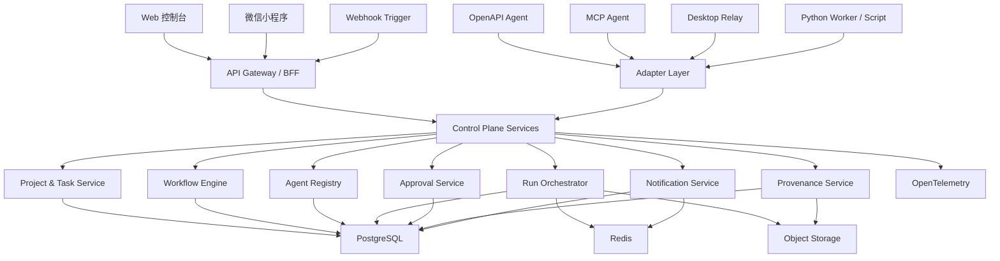
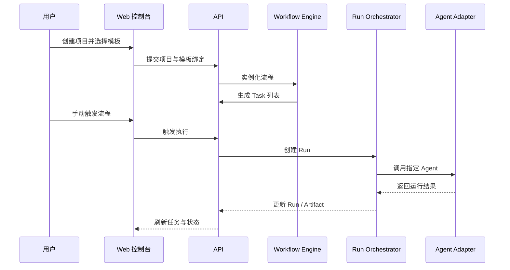
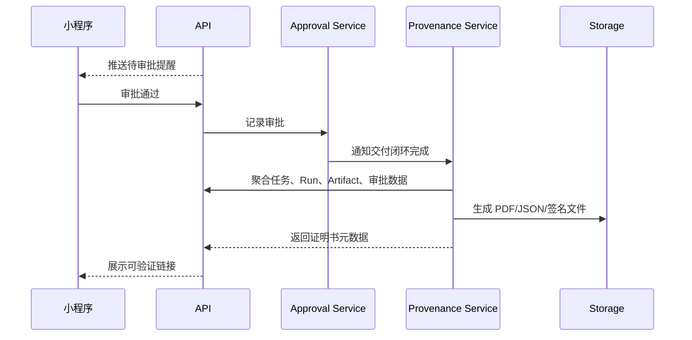

# 系统架构设计

## 1. 架构目标

围绕 `Agent 团队管理 + 工作流编排 + 可信交付证明` 三条主线，为 MVP 建立一套边界清晰、便于快速落地、后续可扩展的控制平面架构。

## 2. 架构原则

- 控制平面与执行平面分离
- 项目对象模型统一驱动产品与技术设计
- MVP 优先单体部署，内部模块化，后续按边界拆分
- 以事件和追踪链路增强可观测性与可审计性
- 接入层采用 Adapter 模式，屏蔽不同 Agent 生态差异
- 证明链路是核心域能力，而不是导出功能

## 3. 首版技术决策

| 领域 | 方案 | 决策理由 |
| --- | --- | --- |
| Web 控制台 | Next.js + React | 生态成熟、适合后台控制台和后续营销页扩展 |
| 小程序 | Taro | 允许与 React 心智和共享逻辑靠近，降低双端成本 |
| 后端 | NestJS | TypeScript 全栈统一、模块化强、适合控制平面建模 |
| 辅助执行层 | Python Worker / Script | 适合 AI 试验、数据处理、离线任务和个别 Agent 执行器封装 |
| 数据库 | PostgreSQL | 适合强关系对象模型、事务和审计场景 |
| 缓存/队列 | Redis | 承担缓存、队列、分布式锁和短期状态 |
| 对象存储 | S3 兼容存储 | 存放日志、附件、证明书、运行产物 |
| 工作流引擎 | MVP 自研轻量状态机 | 快速闭环，避免过早引入复杂编排系统 |
| 可观测性 | OpenTelemetry + Prometheus/Grafana | 建立统一 Trace、Metrics、Logs 能力 |
| 鉴权 | JWT + API Key | 兼顾控制台用户鉴权与 Agent 接入鉴权 |
| 签名 | Ed25519 + SHA-256 | 适合证明书签名和产物摘要校验 |

## 4. 总体架构图



## 5. 模块划分

## 5.1 客户端层

- Web 控制台：复杂配置、项目管理、模板编辑、证明书查看
- 微信小程序：审批、状态追踪、提醒、轻量触发

## 5.2 控制平面层

- Identity 模块：用户、工作区、会话、API Key
- Project 模块：项目、任务、依赖、评论、时间线
- Agent Registry 模块：Agent、能力、接入配置、健康状态
- Workflow 模块：模板、节点、触发器、实例化
- Run 模块：执行调度、状态变更、重试、失败处理
- Approval 模块：审批流、审批记录、驳回原因
- Artifact 模块：产物登记、摘要、存储地址、哈希指纹
- Provenance 模块：证据聚合、签名、证明书生成、验证页
- Notification 模块：站内通知、小程序提醒、后续飞书/企微扩展

## 5.3 接入层

- OpenAPI Adapter：对接远程 Agent 执行器
- MCP Adapter：对接标准 MCP Server 或代理服务
- Webhook Gateway：接收外部系统事件并触发模板
- Desktop Relay：对接本地开发环境或桌面执行器
- Python Worker Bridge：对接独立 Python Worker、离线脚本和专用执行器

## 5.4 语言分工策略

- `TypeScript` 作为主开发语言，承担 Web 控制台、小程序、控制平面 API、工作流引擎、BFF、共享类型和 SDK
- `Python` 作为辅助开发语言，只用于 AI 试验、数据处理、离线生成、专用 Worker 或少量独立执行器
- 核心业务对象和接口协议以 TypeScript 定义为主，Python 侧按协议消费，不反向主导领域模型
- 任何 Python 模块都必须通过明确的任务接口、回调协议或队列协议接入，避免形成第二套控制平面

## 6. 推荐仓库结构

```text
apps/
  api/
  web/
  miniapp/
  worker/
  py-worker/
packages/
  domain/
  ui/
  sdk/
  config/
  observability/
docs/
```

说明：

- `apps/api` 承载控制平面 API
- `apps/worker` 负责异步任务、证明书生成、回调处理
- `apps/py-worker` 负责 Python 辅助任务、实验型 Agent 和离线处理
- `packages/domain` 存放共享领域模型和 DTO
- `packages/sdk` 封装 OpenAPI/MCP 接入客户端

## 7. 核心业务流程

## 7.1 创建项目并启动流程



## 7.2 审批与证明书生成



## 8. 工作流引擎策略

MVP 不直接引入 Temporal，而采用以下轻量策略：

- 模板定义存于 PostgreSQL
- 运行状态机由 `worker + Redis + PostgreSQL` 驱动
- 每个节点具备显式状态和重试次数
- 通过领域事件驱动后续节点流转
- 将触发器、状态机、执行器、审批器抽象为独立接口

这样做的好处：

- 更快完成首版闭环
- 便于围绕项目对象模型打磨产品
- 为未来迁移至 Temporal 预留编排接口

## 9. 关键架构决策

## 9.1 小程序只做控制面

不在小程序中提供复杂流程配置和大画布能力，避免交互体验和研发成本失衡。

## 9.2 Run 作为系统最核心执行对象

所有外部执行、审批、重试、失败处理和证明归集，都以 `Run` 为统一连接点。

## 9.3 Provenance 作为一级域服务

证明书生成不是简单导出，而是标准化证据采集、签名、校验和展示能力。

## 10. 部署建议

- 开发环境：Docker Compose 启动 PostgreSQL、Redis、MinIO、Jaeger
- 测试环境：单独云环境，打通小程序测试链路
- 生产环境：容器化部署，API 与 Worker 分离扩容
- 对象存储与签名密钥使用独立配置管理

## 11. 扩展路线

- 当模板复杂度和并发提升时，可将 Workflow 模块迁移至 Temporal
- 当高频日志分析需求明确后，引入 ClickHouse 做运行分析
- 当生态接入增多时，独立 Adapter Runtime 服务
- 当组织协作变复杂时，再升级权限模型和计费模型
